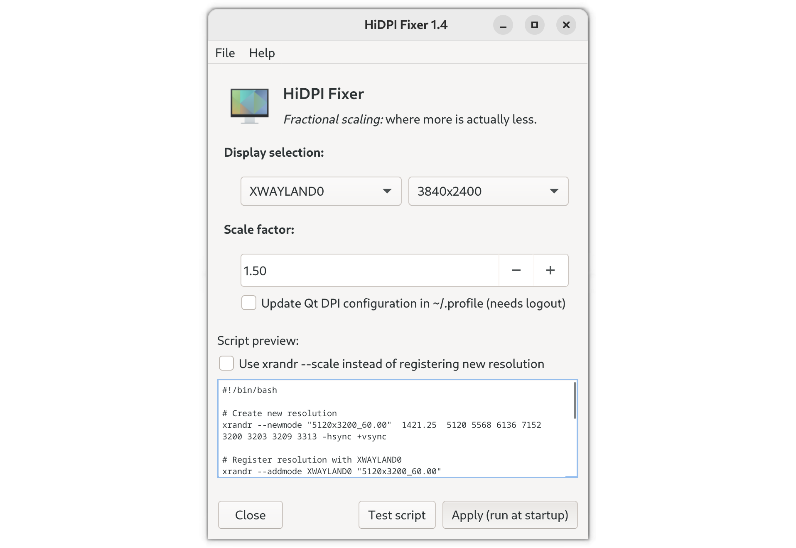

# HiDPI Fixer

This application allows you to create a script that acomplishes the following tasks:
- Allow fractional scaling of your display and its components in X11
- The end result looks nicer and is way less buggy than using Wayland
- The generated script is configured to run everytime you log in
- You can also instruct the application to modify the `~/.profile` file to correctly scale Qt-based apps (as KDE does)
- Tested on GNOME, Deepin Desktop and KDE (you need to manualy set the scaling factor to 200% in Deepin and KDE)

## Screenshot

 

## Installing/running

You can [download](https://github.com/alex-spataru/HiDPI-Fixer/releases/latest) the latest release as an AppImage, no installation required!
After your download finishes, open a terminal and type the following commands:

    cd Downloads                    # Go to directory where you have downloaded/saved HiDPI-Fixer
    chmod +x HiDPI_Fixer*.AppImage  # Make HiDPI-Fixer.AppImage executable
    ./HiDPI_Fixer*.AppImage         # Run HiDPI-Fixer
    
### Uninstalling

To remove all the scripts and startup launchers generated by HiDPI Fixer, open a terminal and type the following:

    cd Downloads                         # Or the location in which you have saved HiDPI-Fixer AppImage
    ./HiDPI_Fixer*.AppImage --uninstall  # Run uninstall command (if you are lazy, just type -u)
    
This command will do the following:
- Remove the `~/.hidpi-fixer` directory and all its contents
- Remove all the startup applications with the name pattern as `HiDPI-Fixer_*.desktop` in the `~/.config/autostart` directory.

All directories and files that HiDPI Fixer removes will be listed in the terminal output.

## How does it work?

This application uses a combination of GNOME's `scaling-factor` setting and `xrandr` commands. Basically, the application calculates the necessary resolution to obtain the desired scaling factor and registers a new resolution with `xrandr`. These commands are saved into a `*.sh` file for every display that you have and are configured to run at startup. 

HiDPI-Fixer also works with DEs other than GNOME, however, you will need to manually set the scaling factor to 200% in the control center application of your desktop environment.

## TODOs/Ideas

- [x] Allow users to choose between creating a custom resolution or using `xrandr 
--scale`, to avoid `BAT MATCH` errors
- [ ] Integrate [`run_scaled`](https://github.com/kaueraal/run_scaled/) to HiDPI-Fixer, by creating custom `*.desktop` files in `./local/share/applications` to fix apps that refuse to do any scaling at all.
- [ ] Instead of generating a startup script, allow users to apply the changes system wide.

Contributions and less-ugly fixes are welcome :octocat:

## Tips

- Some applications such as WPS Office ignore completely the system's DPI setting (and thus cannot do any scaling at all). Given that `HiDPI-Fixer` creates a very large resolution, it may be almost impossible to use these fixed-DPI applications. If you rely on those applications, you can run them with [`run_scaled`](https://github.com/kaueraal/run_scaled/), resulting in an usable, albeit blurry per-application experience. But at least your desktop and HiDPI-friendly apps will look decent :+1:.
- In some cases, `xrandr` will not let you to use resolutions larger than your screen's native resolution, which results in the rather-cryptic `BAD MATCH` error. If you have any idea how to fix this, please contact me or make a PR.

## License

This project is released under the MIT license, for more info, click [here](LICENSE.md).

